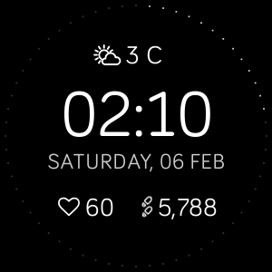

# Alcatel

A simple, elegant digital watch faced based on the [Dribbble designs](https://dribbble.com/shots/3248859-Always-on-lock-screen-concept) for the Alcatel phone brand. Supports per-second updates, heart rate monitoring, steps, always-on display, and weather.

## Setup

In the `companion/` folder, you will need to create a `config.ts` file that exports `API_KEY` as a string constant. This will represent your API key from [OpenWeatherAPI](https://home.openweathermap.org/). There is an example `config-example.ts` file that you can use and rename.
